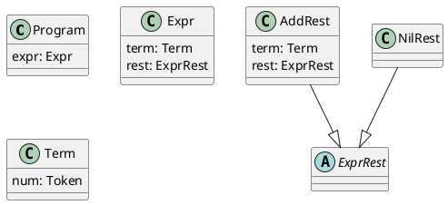

# Phase 2 Part 2: Code Model and Diagram System — Design

**Date:** 2026-04-25
**Status:** APPROVED (diagram interface partially superseded — see note below)

> **Note on diagram interface.** The `plcc-diagram --output=DIR` interface and the `plcc-make --through=diagram` / `--diagram-format` flags described in this document were superseded by [2026-05-25-diagram-decouple-from-make-design.md](2026-05-25-diagram-decouple-from-make-design.md). `plcc-make` no longer has diagram stages; `plcc-diagram` now owns the full emit → build → run pipeline and prints the output path instead of launching a viewer.
**Companion architectural spec:** `docs/design/2026-04-12-multi-lang-pipeline.md`
**Roadmap reference:** `docs/design/2026-04-12-multi-lang-implementation-plan.md` §5

---

## 1. Goal

Deliver a complete, tested `plcc-model` implementation and a new `plcc-diagram-*` plugin
system with a built-in `plcc-plantuml-diagram` plugin. After Part 2:

```sh
plcc-spec arith.plcc | plcc-model | plcc-diagram --output=build/diagram/
```

produces a `build/diagram/diagram.puml` whose rendered class diagram correctly shows all
classes, inheritance, and fields for the arithmetic grammar.

---

## 2. Phase Structure

Phase 2 is divided into three parts:

| Part | Scope | Status |
| --- | --- | --- |
| Part 1 | LL(1) parser (`plcc-ll1`, `plcc-parser-table`) | Complete |
| **Part 2** | **Full `plcc-model` + `plcc-diagram-*` system** | **This design** |
| Part 3 | `plcc-python-emit` + `plcc-rep` | Next |

---

## 3. Test Grammar — Arithmetic Evaluator

The Phase 2 test grammar is a simple arithmetic evaluator (addition with the potential
to extend). It must be LL(1), demonstrate inheritance (at least one nonterminal with
multiple named alternatives), and have fields of both nonterminal and terminal types.

A conforming fixture using the `ExprRest` pattern (standard LL(1) approach):

```text
token NUM   '\d+'
token PLUS  '\+'
skip  SPACE '\s+'
%
<program>              ::= <Expr>expr
<Expr>                 ::= <Term>term <ExprRest>rest
<ExprRest>:AddRest     ::= PLUS <Term>term <ExprRest>rest
<ExprRest>:NilRest     ::=
<Term>                 ::= <NUM>num
%
% calculate Python
AddRest
%%%
def eval(self, acc):
    return self.rest.eval(acc + self.term.eval())
%%%
NilRest
%%%
def eval(self, acc):
    return acc
%%%
Term
%%%
def eval(self):
    return int(self.num.lexeme)
%%%
```

The fixture is saved as `tests/fixtures/arith.plcc`. The implementation plan confirms
or adjusts the exact grammar syntax; the requirements are:

1. LL(1) — `plcc-ll1` reports `is_ll1: true`
2. At least one nonterminal with multiple named alternatives (demonstrating inheritance)
3. Fields of both nonterminal type and terminal (`Token`) type
4. A `% calculate Python` semantic section with method bodies

---

## 4. `model.json` Schema

Output of `plcc-model`. A single JSON document with two top-level keys.

### 4.1 `start`

String. Name of the first nonterminal in the syntax section (lowercased, matching the
`lhs.name` field in spec JSON). Used by downstream tools to identify the root class.

### 4.2 `classes`

Array of class objects derived from the syntax section only. Each object:

```json
{
  "name":     "AddRest",
  "abstract": false,
  "extends":  "ExprRest",
  "fields": [
    {"name": "term", "type": "Term"},
    {"name": "rest", "type": "ExprRest"}
  ]
}
```

**Fields:**
- `name` — class name. For concrete alternatives: `altName` from the rule. For
  nonterminals with a single rule and no `altName`: `lhs.name` capitalized
  (`name[:1].upper() + name[1:]`).
- `abstract` — `true` when the nonterminal has multiple alternatives (each with a
  non-null `altName`). `false` otherwise.
- `extends` — `lhs.name` capitalized when `altName` is non-null; `null` otherwise.
- `fields` — derived from `rhsSymbolList` entries where `isCapturing: true`.
  Field name: `altName` if non-null, else `name.lower()`.
  Field type: `"Token"` for terminals (`isTerminal: true`);
  `name[:1].upper() + name[1:]` for nonterminals (`isTerminal: false`).

**Abstract class rule:** a nonterminal is `abstract: true` when any rule for it has a
non-null `altName` (even if there is only one such alternative). The abstract base class
itself has `fields: []` — fields belong only to concrete subclasses.

**Class ordering:** abstract base classes appear before their concrete subclasses.
Within a group, grammar order is preserved.

### 4.3 `semantic_sections`

Array mirroring the grammar's `% <tool> <language>` sections. Each object:

```json
{
  "language": "Python",
  "tool":     "calculate",
  "fragments": [
    {"class_name": "AddRest", "kind": "body",   "body": "def eval(self, acc):\n    return self.rest.eval(acc + self.term.eval())"},
    {"class_name": "AddRest", "kind": "import", "body": "import something"},
    {"class_name": "Helper",  "kind": "file",   "body": "class Helper:\n    pass"}
  ]
}
```

**Fragment fields:**
- `class_name` — `targetLocator.className` from spec JSON, passed through verbatim.
  `plcc-model` does not parse or validate this string.
- `kind` — computed by `plcc-model` from `targetLocator.modifier` and whether
  `class_name` matches a known class (see §5.2). One of:
  - `"top"` — inject at top of the generated file for this class
  - `"import"` — add import statements to the generated file
  - `"class"` — inject into the class declaration line (e.g. `extends`/`implements`)
  - `"init"` — inject into the constructor
  - `"body"` — append a code block to the class body (methods, fields, etc.)
  - `"file"` — complete file contents; write as a new standalone file named after `class_name`
- `body` — body text extracted from `block.lines`, with leading and trailing `%%%`
  marker lines stripped, and the remaining lines joined with `\n`. Leading/trailing
  whitespace within body lines is preserved — indentation is significant in Python.

**`kind` determination:**

| `targetLocator.modifier` | `class_name` in classes? | `kind` |
| --- | --- | --- |
| `"top"` | — | `"top"` |
| `"import"` | — | `"import"` |
| `"class"` | — | `"class"` |
| `"init"` | — | `"init"` |
| `null` | yes | `"body"` |
| `null` | no | `"file"` |

**`body` extraction:** strip the first line if it is exactly `%%%` and the last line if
it is exactly `%%%`. Join remaining lines with `\n`. Do not strip leading/trailing
whitespace from body lines — indentation is significant in Python and must be preserved.

### 4.4 Complete example

```json
{
  "start": "program",
  "classes": [
    {"name": "Program",  "abstract": false, "extends": null,       "fields": [{"name": "expr", "type": "Expr"}]},
    {"name": "Expr",     "abstract": false, "extends": null,       "fields": [{"name": "term", "type": "Term"}, {"name": "rest", "type": "ExprRest"}]},
    {"name": "ExprRest", "abstract": true,  "extends": null,       "fields": []},
    {"name": "AddRest",  "abstract": false, "extends": "ExprRest", "fields": [{"name": "term", "type": "Term"}, {"name": "rest", "type": "ExprRest"}]},
    {"name": "NilRest",  "abstract": false, "extends": "ExprRest", "fields": []},
    {"name": "Term",     "abstract": false, "extends": null,       "fields": [{"name": "num",  "type": "Token"}]}
  ],
  "semantic_sections": [
    {
      "language": "Python",
      "tool": "calculate",
      "fragments": [
        {"class_name": "AddRest", "kind": "body", "body": "def eval(self, acc):\n    return self.rest.eval(acc + self.term.eval())"},
        {"class_name": "NilRest", "kind": "body", "body": "def eval(self, acc):\n    return acc"},
        {"class_name": "Term",    "kind": "body", "body": "def eval(self):\n    return int(self.num.lexeme)"}
      ]
    }
  ]
}
```

---

## 5. `plcc-model` Changes

`plcc-model` reads spec JSON from stdin and writes `model.json` to stdout.

### 5.1 Class derivation algorithm

1. Collect all syntax rules from `spec.syntax.rules`.
2. Group rules by `lhs.name`.
3. For each nonterminal group:
   - If any rule has a non-null `altName`: mark the nonterminal itself as
     `abstract: true` with `fields: []`; create one concrete class per alternative
     with `extends = lhs.name capitalized` and fields from that alternative's
     `rhsSymbolList`.
   - Otherwise (single rule, null `altName`): create one concrete class with
     `extends: null` and fields from the rule's `rhsSymbolList`.
4. Output abstract base before its concrete subclasses; preserve grammar order
   within each group.

### 5.2 Semantic section pass-through

Build the set of known class names from the `classes` array computed in §5.1.

For each entry in `spec.semantics`:
- Copy `language` and `tool`.
- For each `codeFragment` in `codeFragmentList`:
  - `class_name` ← `targetLocator.className` (verbatim)
  - `kind` ← derived from `targetLocator.modifier` and the known class names set:
    - modifier `"top"` → `"top"`, `"import"` → `"import"`, `"class"` → `"class"`, `"init"` → `"init"`
    - modifier `null` + `class_name` in known classes → `"body"`
    - modifier `null` + `class_name` not in known classes → `"file"`
  - `body` ← join `block.lines` strings with `\n`, stripping leading/trailing
    `%%%` lines.

---

## 6. `plcc-diagram-*` Plugin System

A new plugin namespace parallel to `plcc-lang-*`. Visualizes model JSON as a diagram.
No grammar section required — works for any grammar regardless of target languages.

### 6.1 Commands

**`plcc-diagram`** — dispatcher.
- Reads model JSON from stdin.
- `--format=<fmt>` (default `plantuml`) — constructs `plcc-<fmt>-diagram` and execs
  via PATH, forwarding `--output`, `--verbose`, `--verbose-format`.
- If `plcc-<fmt>-diagram` is not on PATH: exits nonzero with:
  `No diagram plugin found for '<fmt>'. Is plcc-<fmt>-diagram installed?
  Run plcc-diagram-list to see what is available.`
- Accepts `--verbose`/`--verbose-format` per arch spec §9.

**`plcc-diagram-list`** — discovery.
- Scans PATH for executables matching `plcc-*-diagram`.
- Prints one format name per line (strips `plcc-` prefix and `-diagram` suffix).
- Accepts `--verbose`/`--verbose-format` (accept-and-propagate; nothing emitted).

**`plcc-plantuml-diagram`** — built-in PlantUML plugin.
- Reads model JSON from stdin.
- `--output=<dir>` (required) — writes `<dir>/diagram.puml`.
- Accepts `--verbose`/`--verbose-format` per arch spec §9.

### 6.2 Plugin contract (`plcc-<fmt>-diagram`)

- Reads model JSON from stdin.
- Accepts `--output=<dir>` (required).
- Accepts and forwards `--verbose`/`--verbose-format` per arch spec §9.
- Writes diagram file(s) to `<dir>`.
- Exits 0 on success; exits nonzero and writes to stderr on failure.

### 6.3 `plcc-plantuml-diagram` output format

Generates `diagram.puml` for the model's class structure. Semantic sections are ignored.

Rules:
- `abstract: true` → `abstract class ClassName`
- `abstract: false` → `class ClassName {...}` (with field lines inside)
- Field lines: `  name: type` (two-space indent)
- Abstract classes with no fields: no `{}` block
- Non-null `extends` → `ChildClass --|> ParentClass` line after the class block
- Wrapped in `@startuml` / `@enduml`

Example output for the arithmetic grammar:



### 6.4 `plcc-plantuml-emit` retirement

`plcc-plantuml-emit` (introduced in Phase 1 as a language plugin) is retired in Part 2:
- The `plcc-plantuml-emit` command and its source module are removed.
- `plcc-lang-list` no longer finds `plantuml`.
- Grammar fixtures that contained `% diagram PlantUML` sections have those sections
  removed (the trivial grammar fixtures).
- The Phase 1 smoke test is updated to invoke `plcc-diagram` instead of relying on
  the language plugin.

### 6.5 `plcc-make` integration

**Deferred to Phase 4.** `plcc-make` will gain options to control diagram format and
output location. For Part 2, users invoke `plcc-diagram` directly in tests and scripts.

---

## 7. Deferred Items

| Item | Deferred to |
| --- | --- |
| `entry_point` in model | Part 3 — no grammar declaration mechanism yet; Python emitter brainstorm decides where and how it is specified |
| `plcc-make --diagram` flag and options | Phase 4 polish |
| `plcc-python-emit` + runtime library | Part 3 |
| `plcc-rep` REPL | Part 3 |
| Full arithmetic grammar (mul, div, parens) | Part 3 — Part 2 fixture needs only enough structure to validate inheritance and fields |
| Entry-point guidance for extension authors | Note for Part 3 design doc: include guidance on how to choose and document the entry-point hook name for language extension designers |

---

## 8. Acceptance Criteria

1. **Arithmetic fixture is LL(1):** `plcc-spec arith.plcc | plcc-ll1` produces
   `is_ll1: true`.
2. **Model is schema-valid:** `plcc-spec arith.plcc | plcc-model` produces
   schema-valid `model.json` validated against `src/plcc/schemas/model.schema.json`.
3. **Classes are correct:** `model.json` contains the correct class names, abstract
   flags, `extends` relationships, and fields for the arithmetic fixture (verified by
   unit tests and a bats assertion).
4. **Semantic sections pass through:** `model.json` contains the `calculate`/`Python`
   semantic section with correct fragments (verified by unit tests).
5. **Diagram is produced:** `plcc-spec arith.plcc | plcc-model | plcc-diagram
   --output=build/diagram/` produces `build/diagram/diagram.puml`.
6. **Diagram renders:** rendering `diagram.puml` through PlantUML produces a valid
   class diagram with correct classes, inheritance arrows, and fields (manually
   verified; CI runs schema-level check only).
7. **Discovery works:** `plcc-diagram-list` finds `plantuml`.
8. **`plcc-plantuml-emit` is gone:** `plcc-lang-list` no longer lists `plantuml`;
   all affected tests and fixtures are updated.
9. **All existing tests pass:** 431 Python unit tests and 117 bats tests remain green
   after fixture and source updates.
