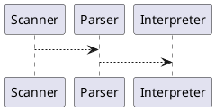

# PlantUML Documentation Diagrams Design

**Date:** 2026-06-10

## Goal

Add PlantUML diagram support to the MkDocs documentation site so that
concept-illustrating diagrams can be embedded alongside prose in any page.

## Decisions

### Rendering: mkdocs-kroki plugin

Use the `mkdocs-kroki` plugin. At build time (both `mkdocs build` and
`mkdocs serve`), the plugin detects `plantuml` fenced code blocks, sends
them to Kroki.io, and replaces them with inline SVG in the generated HTML.

Visitors never contact Kroki.io — the SVGs are baked into the static HTML
before it is served. The Kroki.io call happens once per block per build, so
a class of 50 students viewing the same page simultaneously causes zero
external requests.

### Source: embedded in markdown

Diagram source is written as a fenced code block directly in the markdown
file where the diagram appears:

````markdown

````

No separate `.puml` files. No `diagrams/` folder. Diagrams belong to the
page that uses them, and all diagrams are expected to be local to a single
page.

### Output: no committed image files

Rendered SVGs are embedded inline in the generated HTML. Nothing extra is
committed to the repository.

## Changes Required

1. Add `mkdocs-kroki` to the `dev` dependency group in `pyproject.toml`.
2. Add `kroki` to the `plugins` list in `mkdocs.yml`.

## Workflow

- **Local development:** `bin/docs/serve.bash` — live-reload re-renders
  diagrams on each save.
- **CI deployment:** `mkdocs build` (unchanged) — renders diagrams as part
  of the normal static site build.
