# PlantUML Documentation Diagrams Implementation Plan

> **For agentic workers:** REQUIRED SUB-SKILL: Use superpowers:subagent-driven-development (recommended) or superpowers:executing-plans to implement this plan task-by-task. Steps use checkbox (`- [ ]`) syntax for tracking.

**Goal:** Wire up `mkdocs-kroki-plugin` so PlantUML fenced blocks in markdown render as inline SVG in the docs site.

**Architecture:** Add `mkdocs-kroki-plugin` as a dev dependency and register the `kroki` plugin in `mkdocs.yml`. The plugin intercepts `plantuml` fenced blocks at build time, sends them to Kroki.io, and replaces them with inline SVG. No image files are committed; no separate `.puml` files are used.

**Tech Stack:** PDM (dependency management), MkDocs Material, mkdocs-kroki-plugin, Kroki.io (remote render service)

---

### Task 1: Add and configure the kroki plugin

**Files:**
- Modify: `pyproject.toml` — add `mkdocs-kroki-plugin` to dev dependency group
- Modify: `mkdocs.yml` — add `kroki` to plugins list

- [ ] **Step 1: Add the dependency to pyproject.toml**

In the `[dependency-groups]` `dev` list, add one line after the existing mkdocs entries:

```toml
[dependency-groups]
dev = [
    "pytest>=8.2.0",
    "pyfakefs>=5.4.1",
    "pytest-cov>=5.0.0",
    "pytest-watch>=4.2.0",
    "check-jsonschema>=0.29.0",
    "python-semantic-release>=9.0.0",
    "twine>=5.0.0",
    "mkdocs>=1.6",
    "mkdocs-material>=9.5",
    "mike>=2.1",
    "mkdocs-include-markdown-plugin>=6.0",
    "mkdocs-kroki-plugin>=0.8",
]
```

- [ ] **Step 2: Install the new dependency**

```bash
pdm install
```

Expected: resolves and installs `mkdocs-kroki-plugin` with no errors.

- [ ] **Step 3: Add `kroki` to mkdocs.yml plugins**

The current plugins section is:

```yaml
plugins:
  - search
  - include-markdown
  - mike
```

Change it to:

```yaml
plugins:
  - search
  - include-markdown
  - mike
  - kroki
```

- [ ] **Step 4: Verify the build succeeds with no diagram yet**

```bash
MAIN_ROOT="$(cd "$(git rev-parse --git-common-dir)/.." && pwd)"
PATH="$MAIN_ROOT/.venv/bin:$PATH" mkdocs build --strict 2>&1 | tail -5
```

Expected: last line contains `Documentation built in` with no ERROR lines.

- [ ] **Step 5: Commit**

```bash
git add pyproject.toml pdm.lock mkdocs.yml
git commit -m "feat(docs): add mkdocs-kroki-plugin for PlantUML diagram support [skip ci]"
```

---

### Task 2: Add a pipeline diagram to the Language Guide overview

This task adds the first real diagram — a pipeline showing how the three grammar sections relate — and confirms the plugin renders it correctly end-to-end.

**Files:**
- Modify: `docs/language-guide/index.md` — add plantuml diagram after the sections-build-on-one-another paragraph

- [ ] **Step 1: Add the diagram to language-guide/index.md**

After the bullet list ending with `"...attaches behavior to the parse tree produced by the grammar."` and before the `%include` paragraph, insert:

````markdown

```plantuml
@startuml
left to right direction
skinparam rectangle {
  BackgroundColor #f0f4ff
  BorderColor #336699
}
rectangle "Lexical" as lex
rectangle "Syntactic" as syn
rectangle "Semantic" as sem
lex -right-> syn
syn -right-> sem
@enduml
```

````

- [ ] **Step 2: Build the site and verify SVG is present**

```bash
MAIN_ROOT="$(cd "$(git rev-parse --git-common-dir)/.." && pwd)"
PATH="$MAIN_ROOT/.venv/bin:$PATH" mkdocs build --strict 2>&1 | tail -3
grep -c '<svg' site/language-guide/index.html
```

Expected: `mkdocs build` ends with `Documentation built in ...`, and `grep` prints `1` or higher.

- [ ] **Step 3: Visually verify in the dev server**

```bash
bin/docs/serve.bash
```

Open `http://127.0.0.1:8000/plcc-ng/language-guide/` and confirm the pipeline diagram appears on the Language Guide overview page.

- [ ] **Step 4: Commit**

```bash
git add docs/language-guide/index.md
git commit -m "docs(language-guide): add pipeline diagram to overview [skip ci]"
```
