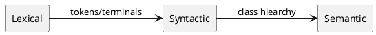

# Language Guide

A plcc-ng specification describes
a language's tokens, syntax, and semantics.

```text
# Lexical section
skip WHITESPACE /\s+/
token NUM /\d+/

%

# Syntactic section
<Exp> ::= <NUM>

%

# Semantic secction
Python

Exp
%%%
def __run__(self):
    print("Hello")
%%%
```

## Comments

Comments start with `#` and end at the end of the current line.
Comments may appear anywhere except in semantic section code blocks.

## Section separators

Each section is separated by a line with a single `%`.

## Includes

Although you can define an entire language in a single file, larger
languages are often easier to maintain when split across multiple files
using the `%include` statement.

```text
%include FILE_PATH
```

`%include` is valid in any section, but may not appear in a code block
within the semantic section. `FILE_PATH` is relative to the directory
containing the file it appears in.

## Optional sections

Sections build on one another:



You can start with only a lexical section (no `%` separator is needed),
or add a syntactic section without defining semantics. This makes it easy
to develop and test a language incrementally.

## What next

- [Lexical Section](lexical.md) — `token` and `skip` syntax, scanning algorithm
- [Syntactic Section](syntactic.md) — BNF rules, parse tree class hierarchy
- [Semantic Section](semantic.md) — embedding code, hooks, target language selection
- [Examples](examples.md) — worked examples of increasing complexity
