# Language Guide

A plcc-ng grammar file describes a language's tokens, syntax, and semantics.

```text
# grammar.plcc

# Lexical section
skip WHITESPACE /\s+/
token NUM /\d+/

%

# Syntactic section
<Exp> ::= <NUM>

% Python

# Semantic section
Exp
%%%
def __run__(self):
    print("Hello")
%%%
```

The Lexical and Syntactic sections are separated by a line with a single `%`.

The semantic section begins with a separator that specifies
the implementation language, such as `% Python` or `% Java`.

The sections build on one another:

- The lexical section defines the tokens recognized by the scanner.
- The syntactic section uses those tokens to define the language grammar.
- The semantic section attaches behavior to the parse tree produced by the grammar.

```plantuml
@startuml
left to right direction
skinparam rectangle {
  BackgroundColor #f0f4ff
  BorderColor #336699
}
rectangle "Lexical" as lex
rectangle "Syntactic" as syn
rectangle "Semantic" as sem
lex -right-> syn
syn -right-> sem
@enduml
```



You can start with only a lexical section (no `%` separator is needed),
or add a syntactic section without defining semantics. This makes it easy
to develop and test a language incrementally.

Although you can define an entire language in a single file, larger
languages are often easier to maintain when split across multiple files
using the `%include` statement.

```text
%include FILE_PATH
```

`%include` is valid in any section, but may not appear in a code block
within the semantic section. `FILE_PATH` is relative to the directory
containing the file it appears in.

## Pages in this guide

- [Lexical Section](lexical.md) — `token` and `skip` syntax, scanning algorithm
- [Syntactic Section](syntactic.md) — BNF rules, parse tree class hierarchy
- [Semantic Section](semantic.md) — embedding code, hooks, target language selection
- [Examples](examples.md) — worked examples of increasing complexity
