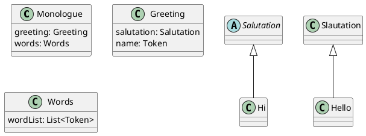

# Syntactic Specification

The syntactic specification defines the structure of your language
in a dialect of BNF. Each production rule maps a nonterminal to
a sequence of symbols on its right-hand side.

Here is an example that will be referenced in the sections below.

```text
# Standard production rules
<Monologue> ::= <Greeting> <Words>
<Greeting> ::= <Salutation> COMMA <NAME>

# Alternative productions for `Salutation`.
<Salutation:Hi> ::= HI
<Salutation:Hello> ::= HELLO

# Matche zero or more `WORD`s.
<Words> **= <WORD>
```

## Names

| Kind | Format | Examples |
| --- | --- | --- |
| Nonterminal (class name) | PascalCase, angle-bracketed | `<Expr>`, `<Program>` |
| Terminal (token name) | UPPER_CASE | `PLUS`, `NUM` |
| Field name (captured symbol) | camelCase | `expr`, `num`, `rest` |
| Subclass name | PascalCase | `AddExpr`, `NilRest` |

Literals such as "+" and "," are not supported. Instead, define the literal
as a token in the lexical section and refer to it here.

## Start Symbol

The first rule defines the start symbol.

`Monologue` is the start symbol in the Monologue example above.

## Matching nothing

It's also possible for a production to produce nothing (A.K.A. epsilon):

```text
<OptElse:HasElse> ::= ELSE <Stmt>
<OptElse:NoElse>  ::=
```

## Generated class/object structure

Each production rule defines the structure for the nonterminal named
on the left-hand side, and generates a class. Returning to our Monologue
example.



An the right-hand side, anything written in angle brackets becomes a field.
If you don't specify a field name, plcc-ng generates one.

### Capturing terminals

Wrap a terminal in angle brackets to capture it.
The name of a field is the lower-cased name of the terminal. You may
provide a different field name using `:fieldname`.

```text
<Term> ::= NUM         # matches NUM but does not capture it
<Term> ::= <NUM>       # captures NUM as field `num`
<Term> ::= <NUM:age>   # captures NUM as field `age`
```

Providing a different field name is especially important when a rule
has two terms on the right-hand side that would
generate two fields with the same name.

```text
<Pair> ::= <NUM:x> <NUM:y>
```

If we did not provide the names `x` and `y`, plcc-ng would have generated
two fields with the same name `num`, which would not compile and run.

The type of a capture token field is `Token`.

### Capturing nonterminals

All nonterminals are captured. Their field names will be the nonterminal
name lower-cased. You may provide a different field name using `:fieldname`.

```text
<Program> ::= <Expr>              # captures Expr as field `expr`
<Program> ::= <Expr:expression>   # captures Expr as field `expression`
```

Providing a different field name is especially important when a rule
has two terms on the right-hand side that would
generate two fields with the same name.

```text
<Pair> ::= <Expr:left> <Expr:right>
```

If we did not provide the names `left` and `right`, plcc-ng would have generated
two fields with the same name `expr`, which would not compile and run.

The type of a capture nonterminal field is the class with the same name
as the nonterminal.

### Alternative rules and subclasses

When a nonterminal has multiple rules, each alternative must be given
a name. This name will be the class generated for that rule and will
be a subclass of the nonterminal class.

```text
<Expr:LitExpr> ::= <NUM:num>
<Expr:AddExpr> ::= PLUS <Expr:left> <Expr:right>
```

This generates:

```java
abstract class Expr { }
class LitExpr extends Expr  { Token num; }
class AddExpr extends Expr  { Expr left; Expr right; }
```

```python
class Expr:
    pass

@dataclass
class LitExpr(Expr):
    num: Token

@dataclass
class AddExpr(Expr):
    left: Expr
    right: Expr
```

Subclass names are required only when a non-terminal
has more than one production.

### Repetition rules

The `**=` form matches zero or more occurrences of a pattern,
with an optional separator:

```text
<Args>  **= <Expr:expr>
<Pairs> **= <WHOLE:x> <WHOLE:y> +COMMA
```

Captured symbols become parallel lists:

```java
class Args { List<Expr> exprList; }
class Pairs { List<Token> xList; List<Token> yList; }
```

```python
@dataclass
class Args:
    exprList: List[Expr]

@dataclass
class Pairs:
    xList: List[Token]
    yList: List[Token]
```

For example, for Pairs, assuming WHOLE matches an integer token, given this input:

```text
2 3, 5 6, 7 8
```

xList and yList would contains the following:

```python
xList = [Token("2"), Token("5"), Token("7")]
yList = [Token("3"), Token("6"), Token("8")]
```

When given, the separator token must appear between each ocurrance of the
right-hand side. Assuming WHOLE matches an integer token, valid inputs for
Pairs include:

```text
1 2
3 4, 5 6
7 8,9 10  , 11 12
```

The separator token is not captured in the parse tree.

## Parse algorithm

plcc-ng generates a top-down LL(1) parser.
Every parsing decision must be resolvable using a single lookahead token.
If multiple alternatives can match the same lookahead token,
plcc-ng reports an LL(1) conflict.
